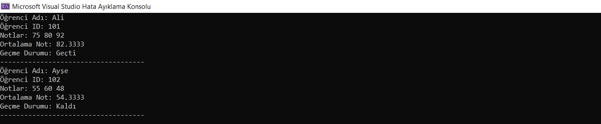

# ogrenci-sinif-ornegi
*Bu C++ programı, bir öğrenciyi temsil eden `Student` sınıfını ve bu sınıfı kullanarak iki öğrenci nesnesi oluşturan basit bir örnek içerir. Her öğrenci için isim, öğrenci ID'si ve notlar gibi bilgileri yöneten bir sınıftır.*

# `Student` Sınıfı
- `Student` sınıfı, bir öğrenciyi temsil eder ve isim, öğrenci ID'si ve notlar gibi özelliklere sahiptir.
- `setGrades` fonksiyonu, öğrencinin notlarını belirlemek için kullanılır.
- `calculateAverageGrade` fonksiyonu, öğrencinin not ortalamasını hesaplar.
- `isPassing` fonksiyonu, öğrencinin geçip geçmediğini kontrol eder (not ortalaması 60 ve üstü ise geçer).
- `displayInfo` fonksiyonu, öğrencinin bilgilerini ekrana yazdırır.

# `main` Fonksiyonu
- `main` fonksiyonu, iki öğrenci nesnesi oluşturur (Ali ve Ayşe).
- Notları belirlenir ve bilgileri ekrana yazdırmak için `displayInfo` fonksiyonu kullanılır.

# Örnek Kullanım
- `main` fonksiyonu içinde öğrenci nesneleri oluşturularak notları belirlenir.
- Her öğrencinin bilgileri `displayInfo` fonksiyonu kullanılarak ekrana yazdırılır.

# Ekran Resmi

# Bilgilendirme
**---------------------------------------------------------**
| Herkese Açık | Geliştirilebilir | Zyra Software|
|---------|---------|---------|
| Açık | Geliştirilebilir |@zyrasoftware |

